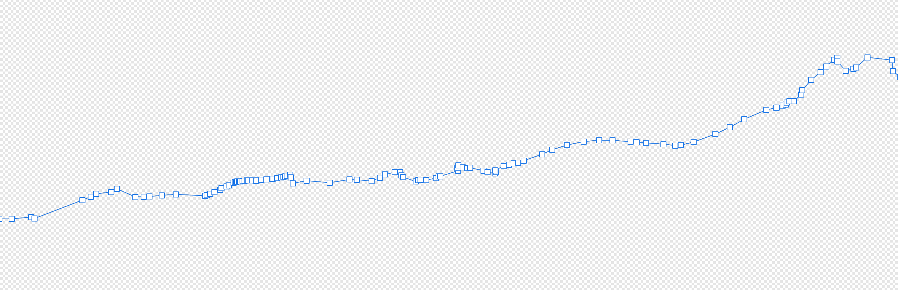
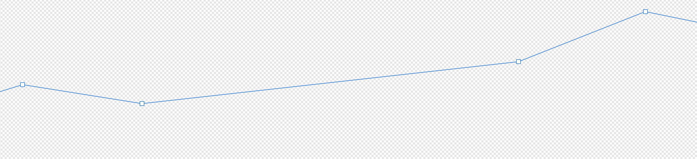

**TimezoneTurbo can be used both in browser and on Node.**  

# What's TimezoneTurbo?
It's a fast geographical lookup of timezones for clientside purpose. The package is about 4MB (or 2.8MB gzipped), which may seem fairly large but it includes high precision encoded polygons of every single timezone on Earth!

TimezoneTurbo lookup is fast (usually less than 3ms per lookup) and gives you extra information about the local coordinates:
- Time zone ID
- nicely formated local datetime
- local datetime for sunset/sunrise and more for the default day (default: current day), the day before and the day after
- moon informations for the default day (default: current day), the day before and the day after

# Install
```
npm install timezoneturbo
```


# Usage
As ES6 module:  
```js
import { getLocalTimeInfo } from 'timezoneturbo'

// WGS84 coordinates
const coordinates = [
  1.7224880382775285,  // longitude
  47.51196172248804, // latitude
]

const tzData = getLocalTimeInfo(coordinates)
```

In Node/CJS:  
```js
const getLocalTimeInfo = require('timezoneturbo').getLocalTimeInfo

// WGS84 coordinates
const coordinates = [
  1.7224880382775285, // longitude
  47.51196172248804, // latitude
]

const tzData = getLocalTimeInfo(coordinates)
```

In regular HTML:
```html
<script src="./dist/timezoneturbo.umd.js"></script>
<!-- Alternatively, use the minified version: -->
<!-- <script src="./dist/timezoneturbo.umd.min.js"></script> -->

<script>
  // WGS84 coordinates
  const coordinates = [
    1.7224880382775285, // longitude
    47.51196172248804, // latitude
  ]

  const tzData = timezoneturbo.getLocalTimeInfo(lonLat)
</script>
```

The resulting `tzData` object contains:  
```json
{
  "lonLat": [
    1.7224880382775285,
    47.51196172248804
  ],
  "timezone": "Europe/Paris",
  "unixTimestamp": 1639075761.711,
  "localTime": "2021-12-09, 19:49:21 GMT+1",
  "sun": {
    "previousDay": {
      "solarNoon": "2021-12-08, 12:46:29 GMT+1",
      "nadir": "2021-12-08, 24:46:29 GMT+1",
      "sunrise": "2021-12-08, 08:29:22 GMT+1",
      "sunset": "2021-12-08, 17:03:36 GMT+1",
      "sunriseEnd": "2021-12-08, 08:33:11 GMT+1",
      "sunsetStart": "2021-12-08, 16:59:47 GMT+1",
      "dawn": "2021-12-08, 07:53:48 GMT+1",
      "dusk": "2021-12-08, 17:39:09 GMT+1",
      "nauticalDawn": "2021-12-08, 07:14:53 GMT+1",
      "nauticalDusk": "2021-12-08, 18:18:05 GMT+1",
      "nightEnd": "2021-12-08, 06:37:37 GMT+1",
      "night": "2021-12-08, 18:55:21 GMT+1",
      "goldenHourEnd": "2021-12-08, 09:21:15 GMT+1",
      "goldenHour": "2021-12-08, 16:11:43 GMT+1"
    },
    "currentDay": {
      "solarNoon": "2021-12-09, 12:46:55 GMT+1",
      "nadir": "2021-12-09, 24:46:55 GMT+1",
      "sunrise": "2021-12-09, 08:30:22 GMT+1",
      "sunset": "2021-12-09, 17:03:27 GMT+1",
      "sunriseEnd": "2021-12-09, 08:34:12 GMT+1",
      "sunsetStart": "2021-12-09, 16:59:38 GMT+1",
      "dawn": "2021-12-09, 07:54:45 GMT+1",
      "dusk": "2021-12-09, 17:39:05 GMT+1",
      "nauticalDawn": "2021-12-09, 07:15:47 GMT+1",
      "nauticalDusk": "2021-12-09, 18:18:03 GMT+1",
      "nightEnd": "2021-12-09, 06:38:29 GMT+1",
      "night": "2021-12-09, 18:55:21 GMT+1",
      "goldenHourEnd": "2021-12-09, 09:22:23 GMT+1",
      "goldenHour": "2021-12-09, 16:11:27 GMT+1"
    },
    "nextDay": {
      "solarNoon": "2021-12-10, 12:47:21 GMT+1",
      "nadir": "2021-12-10, 24:47:21 GMT+1",
      "sunrise": "2021-12-10, 08:31:20 GMT+1",
      "sunset": "2021-12-10, 17:03:22 GMT+1",
      "sunriseEnd": "2021-12-10, 08:35:10 GMT+1",
      "sunsetStart": "2021-12-10, 16:59:32 GMT+1",
      "dawn": "2021-12-10, 07:55:40 GMT+1",
      "dusk": "2021-12-10, 17:39:03 GMT+1",
      "nauticalDawn": "2021-12-10, 07:16:39 GMT+1",
      "nauticalDusk": "2021-12-10, 18:18:04 GMT+1",
      "nightEnd": "2021-12-10, 06:39:19 GMT+1",
      "night": "2021-12-10, 18:55:23 GMT+1",
      "goldenHourEnd": "2021-12-10, 09:23:28 GMT+1",
      "goldenHour": "2021-12-10, 16:11:14 GMT+1"
    }
  },
  "moon": {
    "previousDay": {
      "rise": "2021-12-08, 12:30:59 GMT+1",
      "set": "2021-12-08, 21:37:00 GMT+1",
      "fraction": 0.2517495327388652,
      "phase": 0.16730896543401935,
      "angle": -1.8353881755245698,
      "azimuth": 0.6783003495669113,
      "altitude": 0.22393656702193765,
      "distance": 373130.5328367068,
      "parallacticAngle": 0.46950725946878014
    },
    "currentDay": {
      "rise": "2021-12-09, 13:01:12 GMT+1",
      "set": "2021-12-09, 22:55:28 GMT+1",
      "fraction": 0.35407677640126894,
      "phase": 0.2028651874841162,
      "angle": -1.9114983968104389,
      "azimuth": 0.506381576092079,
      "altitude": 0.37809643715161545,
      "distance": 377327.755516292,
      "parallacticAngle": 0.3479581118661091
    },
    "nextDay": {
      "rise": "2021-12-10, 13:26:50 GMT+1",
      "fraction": 0.46092734100141763,
      "phase": 0.23755009307942787,
      "angle": -1.9635664433969007,
      "azimuth": 0.3191001393128391,
      "altitude": 0.5194955954662528,
      "distance": 381922.23331837234,
      "parallacticAngle": 0.2175852436766208
    }
  }
}
```
The lunar and solar informations are computed by [@mourner](https://twitter.com/mourner)'s [Suncalc](https://github.com/mourner/suncalc). I thought it was a nice addition.

By default, TimezoneTurbo uses the current date, but a **custom date** can also be provided:   
```js
// A date with a timezone info
const d = new Date('1985-01-27, 12:18:28 GMT+1')

// Location near NYC, not in GMT+1
const coordinates = [-75.50239234449762, 37.75119617224882]
const tzData = getLocalTimeInfo(coordinates, {date: d})
```


# Data generation
If you are curious about how the data fueling TimezoneTurbo were generated, have a look at [this repo](https://github.com/jonathanlurie/geodatapreparation). Or just continue reading.


## How is the timezone data prepared?
Timezone data is actually polygons of all shapes and sizes that represent teritories on Earth. As a general rule, each country has it's own timezone polygons (more than one for the largest countries or those with overseas territories). These timezone polygons are roughly delimitted by political border, the only exception being coatal areas, where the timezone polygons goes a bit beyond the terestrial zone. Those timezones usualy have an ID that is composed of the name of the continent and the major political city, for example `Europe/Paris` or `America/Los_Angeles` and in some minor case, the country is included (mostly in South America): `America/Argentina/Buenos_Aires`. Then, there are also timezones for large waterbodies such as international waters. Since those do not belong to any political entity and are not impacted by DST, they are just called with the shift to GMT. Example: `Etc/GMT+7`. The grand total is 451 timezones and 1304 polygons.

All the timezone polygons used in TimezoneTurbo are borrowed from the project [timezone-boundary-builder](https://github.com/evansiroky/timezone-boundary-builder) and are originaly serialized into JSON format.  

Those polygons are of a fairly high definition, to high to be easily portable and/or loaded in one bulk in the browser (~44MB). For this reason, I've decided to simplify the lines using a [Douglas-Peucker methods](https://github.com/mourner/simplify-js).  

As an example, this is what 5km of France-Switzerland border look like in the original package:
  

And how it looks like when simplified:
  

Yet, we are still having a decent spatial precision. I've tried many downsampling tolerance distances and this one was a good middleground, allowing for having the entire world in under 3MB including all the fast lookup spatial structures.  

Once simplified, some polygons become so small that there area becomes 0. We don't keep those.

## How to reach under 3MB?
Fist, I have decided not to deal with holes in timezone polygons and I am actually not even sure there are any, since timezones to countries is not a 1-to-1 relationship and it would make little sense (though, this may happen, mainly for polytical reasons). The other reason to not deal with holes is that it simplifies greatly the datastructure: one timezone composed of N polygons is just N binary buffers containing little endian `float32` as follow: `lon1 lat1 lon2 lat2 ... lonN latN lon1 lat1`. No header, no metadata, just the bare minimum, we know how many points there are in the buffer as follow: `bufferByteSize / 8` (divide by 4 because a float32 takes 4 bytes and then again by 2 because we need two number for one coordinate). I also found that zipping was not worth because most of these polygons are fairly small but with hardly any number repetition, hence resulting in a poor compression ratio and the overhead of storing compression metadata was eventualy just making larger buffers.  

Once the polygon buffers are prepared, they are encoded from JSON array to `Float32Array`, then to `ArrayBuffer` and finaly encoded into `base64` strings. The advantage of using `base64` is that it's much more compact than regular JSON numerical arrays and since `base64` buffers are still strings, we can make it part of the JS bundle. The cons is that `base64` is still about 35% larger than its binary equivalent (that's alright imo) and that it's not human readable anymore, but honnestly I was not going to spend too much time reading timezone polygons anyways.

## Bounding boxes and Bounding Volume Hierarchy
In addition to storing timezone polygons as `base64` strings, we also want to prepare a way to quickly look up a lon/lat coordinate without having to test each and every polygon, because remember, 1304 polygons means an average of 652 tests before we find the right one. That's quite a lot of tests. The solution is well known from game developers and computer graphics people, it is called an "accelerating structure". I have decided to develelop my own 2D [bounding volume hierarchy ("BVH")](https://en.wikipedia.org/wiki/Bounding_volume_hierarchy) to obtain a super fast spatial lookup where, at first, all the polygons are represented only by their axis-aligned bounding-box ("AABB"). A hit test such as "is this point inside that AABB?" is much faster than performing a test with a complex polygon, and in the end, only a 3 AABB or less will be hitting the point. Only then, we can go for a full featured complex polygon test and there can be only one.  
The top-down approach of hit test on a BVH makes it so that, very quickly, many branches of the BVH tree are being discarded so that in the end, what was supposed to be 600+ test becomes 10 or 11, so almost a *O(log n)*, since AABB can overlap.

The BVH is also serialize into JSON and made part of the JS bundle.

## How is it used?
The BVH tree being serialized into the bundle, it is used as any native JS oject. The polygon data, encoded in `base64` strings, are only decoded and cached as proper numerical array on-demand, meaning when their timezone bounding box is intersected. The average polygon is decoded in about 1ms and with caching, this happens only once per timmezone.